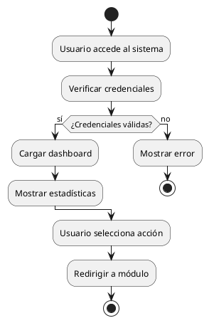
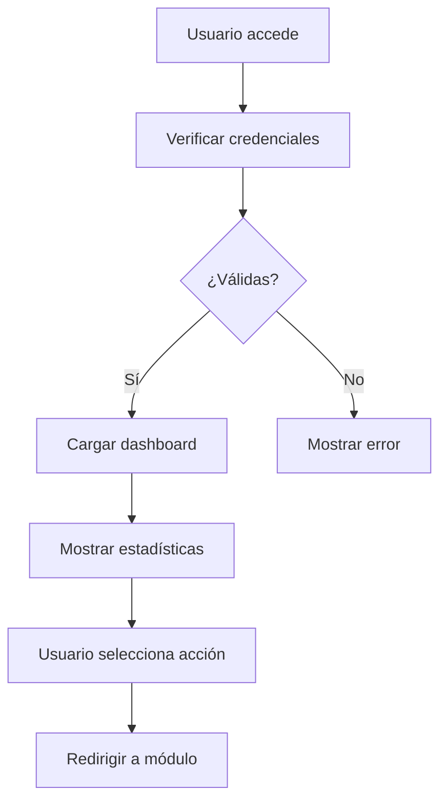
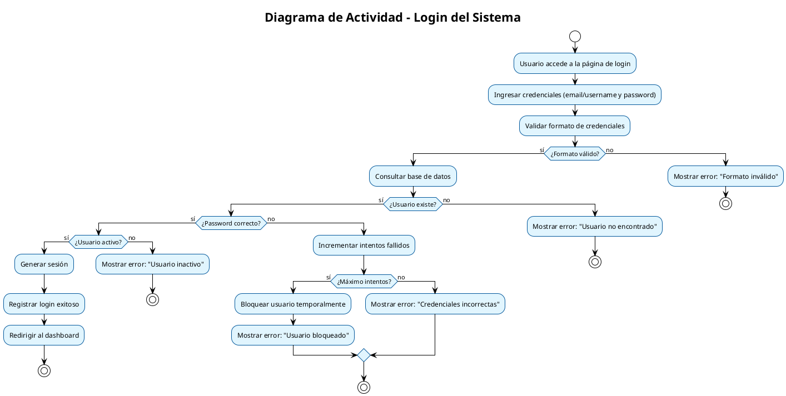
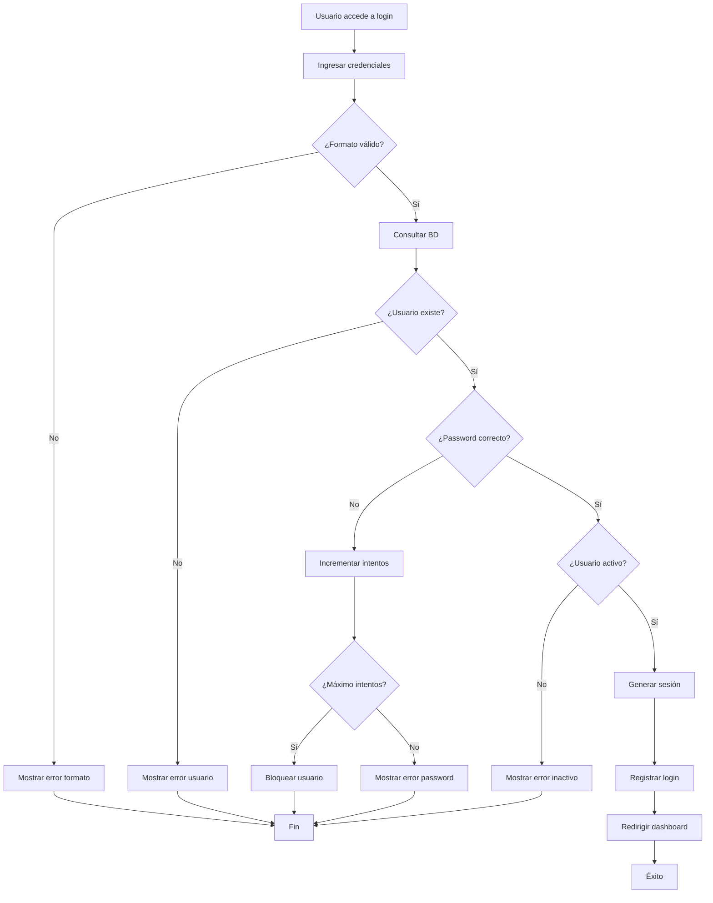
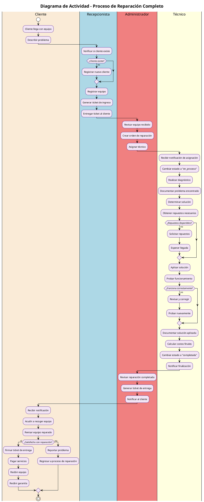
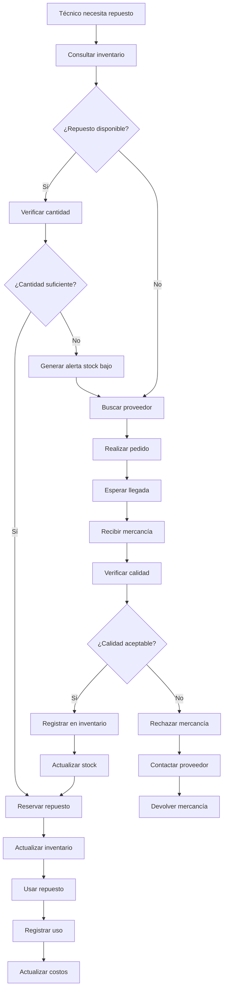

# 🔄 Guía Completa de Diagramas de Actividad - Sistema HDC

## 🎯 **Introducción a los Diagramas de Actividad**

Los diagramas de actividad son representaciones visuales que muestran el flujo de trabajo paso a paso de los procesos del sistema. En el Sistema HDC, estos diagramas nos ayudan a entender cómo fluyen las actividades entre los diferentes módulos y actores.

---

## 📋 **Índice de Contenidos**

1. [Conceptos Básicos](#conceptos-básicos)
2. [Módulos del Sistema HDC](#módulos-del-sistema-hdc)
3. [Diagramas por Módulo](#diagramas-por-módulo)
4. [Flujos Intermódulos](#flujos-intermódulos)
5. [Herramientas para Crear Diagramas](#herramientas-para-crear-diagramas)
6. [Ejemplos Prácticos](#ejemplos-prácticos)

---

## 📚 **Conceptos Básicos** {#conceptos-básicos}

### **¿Qué es un Diagrama de Actividad?**
Un diagrama de actividad muestra el flujo de control de un proceso, incluyendo:
- **Actividades**: Pasos o tareas que se realizan
- **Decisiones**: Puntos donde se toman decisiones (diamantes)
- **Flujos**: Flechas que indican la secuencia
- **Actores**: Quién realiza cada actividad
- **Estados**: Condiciones del sistema

### **Elementos Principales**
```
┌─────────────┐    ┌─────────────┐    ┌─────────────┐
│   Inicio    │───▶│  Actividad  │───▶│    Fin      │
│   (Círculo) │    │ (Rectángulo)│    │  (Círculo)  │
└─────────────┘    └─────────────┘    └─────────────┘

┌─────────────┐
│  Decisión   │
│ (Diamante)  │
└─────────────┘
```

### **Símbolos UML para Actividades**
- **🟢 Inicio**: Círculo negro sólido
- **🔴 Fin**: Círculo con borde negro
- **📦 Actividad**: Rectángulo con bordes redondeados
- **💎 Decisión**: Diamante
- **➡️ Flujo**: Flecha
- **🏊 Swimlane**: Líneas verticales (actores)

---

## 🏗️ **Módulos del Sistema HDC** {#módulos-del-sistema-hdc}

### **1. 📊 Módulo Dashboard**
**Propósito**: Panel principal con estadísticas y resúmenes
**Actores**: Todos los usuarios (con diferentes niveles)
**Funcionalidades**:
- Visualización de estadísticas
- Acceso rápido a módulos
- Búsqueda global
- Notificaciones

### **2. 👥 Módulo de Clientes**
**Propósito**: Gestión de información de clientes
**Actores**: Administrador, Técnico, Usuario
**Funcionalidades**:
- CRUD de clientes
- Búsqueda y filtros
- Historial de servicios
- Gestión de contactos

### **3. 💻 Módulo de Equipos**
**Propósito**: Gestión de equipos a reparar
**Actores**: Administrador, Técnico, Usuario
**Estados**: recibido → en_reparacion → reparado → entregado
**Funcionalidades**:
- Registro de equipos
- Seguimiento de estados
- Asociación con clientes
- Historial de reparaciones

### **4. 🔧 Módulo de Reparaciones**
**Propósito**: Proceso completo de reparaciones
**Actores**: Administrador, Técnico
**Estados**: pendiente → en_proceso → completada → cancelada
**Funcionalidades**:
- Creación de órdenes de reparación
- Asignación de técnicos
- Seguimiento de progreso
- Gestión de costos

### **5. 👨‍🔧 Módulo de Técnicos**
**Propósito**: Gestión de técnicos especializados
**Actores**: Administrador
**Funcionalidades**:
- CRUD de técnicos
- Asignación de especialidades
- Gestión de carga de trabajo
- Evaluación de rendimiento

### **6. 🎫 Módulo de Tickets**
**Propósito**: Generación y gestión de tickets
**Actores**: Administrador, Técnico, Cliente
**Tipos**: ingreso, entrega, servicio
**Estados**: generado → firmado → entregado → anulado
**Funcionalidades**:
- Generación de tickets
- Firma digital
- Impresión
- Seguimiento de estados

### **7. 📦 Módulo de Inventario**
**Propósito**: Control de stock y productos
**Actores**: Administrador, Técnico (limitado)
**Funcionalidades**:
- CRUD de productos
- Control de stock
- Gestión de categorías
- Alertas de stock bajo

### **8. ⚙️ Módulo de Configuración**
**Propósito**: Configuración del sistema
**Actores**: Administrador
**Funcionalidades**:
- Configuración general
- Gestión de módulos
- Configuración de permisos
- Personalización de interfaz

---

## 🔄 **Diagramas por Módulo** {#diagramas-por-módulo}

### **1. 📊 Diagrama de Actividad: Dashboard**

#### **Flujo Principal del Dashboard**
```
┌─────────────┐
│   Usuario   │
│  accede al  │
│  sistema    │
└─────────────┘
       │
       ▼
┌─────────────┐
│ Verificar   │
│ credenciales│
└─────────────┘
       │
       ▼
┌─────────────┐
│ Cargar      │
│ Dashboard   │
└─────────────┘
       │
       ▼
┌─────────────┐
│ Mostrar     │
│ estadísticas│
└─────────────┘
       │
       ▼
┌─────────────┐
│ Usuario     │
│ selecciona  │
│ acción      │
└─────────────┘
       │
       ▼
┌─────────────┐
│ Redirigir   │
│ a módulo    │
│ seleccionado│
└─────────────┘
```

#### **Actividades Detalladas del Dashboard**
1. **Autenticación**: Verificar credenciales del usuario
2. **Carga de Datos**: Obtener estadísticas del sistema
3. **Renderizado**: Mostrar información en la interfaz
4. **Interacción**: Permitir navegación a otros módulos
5. **Búsqueda Rápida**: Proporcionar acceso directo a funcionalidades

### **2. 👥 Diagrama de Actividad: Gestión de Clientes**

#### **Flujo de Registro de Cliente**
```
┌─────────────┐
│ Usuario     │
│ accede a    │
│ Clientes    │
└─────────────┘
       │
       ▼
┌─────────────┐
│ Seleccionar │
│ "Nuevo      │
│ Cliente"    │
└─────────────┘
       │
       ▼
┌─────────────┐
│ Completar   │
│ formulario  │
└─────────────┘
       │
       ▼
┌─────────────┐
│ Validar     │
│ datos       │
└─────────────┘
       │
       ▼
┌─────────────┐
│ ¿Datos      │
│ válidos?    │
└─────────────┘
       │
   ┌───┴───┐
   │       │
   ▼       ▼
┌─────┐ ┌─────────────┐
│ No  │ │ Sí          │
└─────┘ │ Guardar     │
   │    │ cliente     │
   │    └─────────────┘
   │           │
   │           ▼
   │    ┌─────────────┐
   │    │ Mostrar     │
   │    │ mensaje     │
   │    │ éxito       │
   │    └─────────────┘
   │           │
   │           ▼
   │    ┌─────────────┐
   │    │ Redirigir   │
   │    │ a vista     │
   │    │ detallada   │
   │    └─────────────┘
   │
   ▼
┌─────────────┐
│ Mostrar     │
│ errores     │
└─────────────┘
```

#### **Flujo de Búsqueda de Cliente**
```
┌─────────────┐
│ Usuario     │
│ ingresa     │
│ criterio    │
│ búsqueda    │
└─────────────┘
       │
       ▼
┌─────────────┐
│ Aplicar     │
│ filtros     │
└─────────────┘
       │
       ▼
┌─────────────┐
│ Ejecutar    │
│ consulta    │
│ BD          │
└─────────────┘
       │
       ▼
┌─────────────┐
│ Mostrar     │
│ resultados  │
└─────────────┘
       │
       ▼
┌─────────────┐
│ Usuario     │
│ selecciona  │
│ cliente     │
└─────────────┘
       │
       ▼
┌─────────────┐
│ Mostrar     │
│ detalles    │
└─────────────┘
```

### **3. 💻 Diagrama de Actividad: Gestión de Equipos**

#### **Flujo de Registro de Equipo**
```
┌─────────────┐
│ Cliente     │
│ llega con   │
│ equipo      │
└─────────────┘
       │
       ▼
┌─────────────┐
│ Verificar   │
│ cliente     │
│ existe      │
└─────────────┘
       │
       ▼
┌─────────────┐
│ ¿Cliente    │
│ existe?     │
└─────────────┘
       │
   ┌───┴───┐
   │       │
   ▼       ▼
┌─────┐ ┌─────────────┐
│ No  │ │ Sí          │
└─────┘ │ Registrar   │
   │    │ equipo      │
   │    └─────────────┘
   │           │
   │           ▼
   │    ┌─────────────┐
   │    │ Asignar     │
   │    │ estado      │
   │    │ "recibido"  │
   │    └─────────────┘
   │           │
   │           ▼
   │    ┌─────────────┐
   │    │ Generar     │
   │    │ ticket      │
   │    │ ingreso     │
   │    └─────────────┘
   │
   ▼
┌─────────────┐
│ Crear       │
│ cliente     │
│ primero     │
└─────────────┘
       │
       ▼
┌─────────────┐
│ Volver a    │
│ verificar   │
└─────────────┘
```

#### **Flujo de Cambio de Estado de Equipo**
```
┌─────────────┐
│ Técnico     │
│ selecciona  │
│ equipo      │
└─────────────┘
       │
       ▼
┌─────────────┐
│ Verificar   │
│ estado      │
│ actual      │
└─────────────┘
       │
       ▼
┌─────────────┐
│ Seleccionar │
│ nuevo       │
│ estado      │
└─────────────┘
       │
       ▼
┌─────────────┐
│ ¿Estado     │
│ válido?     │
└─────────────┘
       │
   ┌───┴───┐
   │       │
   ▼       ▼
┌─────┐ ┌─────────────┐
│ No  │ │ Sí          │
└─────┘ │ Actualizar  │
   │    │ estado      │
   │    └─────────────┘
   │           │
   │           ▼
   │    ┌─────────────┐
   │    │ Notificar   │
   │    │ cambios     │
   │    └─────────────┘
   │
   ▼
┌─────────────┐
│ Mostrar     │
│ error       │
└─────────────┘
```

### **4. 🔧 Diagrama de Actividad: Gestión de Reparaciones**

#### **Flujo de Creación de Reparación**
```
┌─────────────┐
│ Admin       │
│ selecciona  │
│ equipo      │
└─────────────┘
       │
       ▼
┌─────────────┐
│ Verificar   │
│ equipo      │
│ disponible  │
└─────────────┘
       │
       ▼
┌─────────────┐
│ ¿Equipo     │
│ disponible? │
└─────────────┘
       │
   ┌───┴───┐
   │       │
   ▼       ▼
┌─────┐ ┌─────────────┐
│ No  │ │ Sí          │
└─────┘ │ Crear       │
   │    │ reparación  │
   │    └─────────────┘
   │           │
   │           ▼
   │    ┌─────────────┐
   │    │ Asignar     │
   │    │ técnico     │
   │    └─────────────┘
   │           │
   │           ▼
   │    ┌─────────────┐
   │    │ Establecer  │
   │    │ fecha       │
   │    │ inicio      │
   │    └─────────────┘
   │           │
   │           ▼
   │    ┌─────────────┐
   │    │ Cambiar     │
   │    │ estado      │
   │    │ equipo      │
   │    └─────────────┘
   │
   ▼
┌─────────────┐
│ Mostrar     │
│ error       │
└─────────────┘
```

#### **Flujo de Proceso de Reparación**
```
┌─────────────┐
│ Técnico     │
│ recibe      │
│ reparación  │
└─────────────┘
       │
       ▼
┌─────────────┐
│ Cambiar     │
│ estado a    │
│ "en_proceso"│
└─────────────┘
       │
       ▼
┌─────────────┐
│ Realizar    │
│ diagnóstico │
└─────────────┘
       │
       ▼
┌─────────────┐
│ Documentar  │
│ problema    │
└─────────────┘
       │
       ▼
┌─────────────┐
│ Aplicar     │
│ solución    │
└─────────────┘
       │
       ▼
┌─────────────┐
│ ¿Reparación │
│ exitosa?    │
└─────────────┘
       │
   ┌───┴───┐
   │       │
   ▼       ▼
┌─────┐ ┌─────────────┐
│ No  │ │ Sí          │
└─────┘ │ Cambiar     │
   │    │ estado a    │
   │    │ "completada"│
   │    └─────────────┘
   │           │
   │           ▼
   │    ┌─────────────┐
   │    │ Documentar  │
   │    │ solución    │
   │    └─────────────┘
   │           │
   │           ▼
   │    ┌─────────────┐
   │    │ Calcular    │
   │    │ costos      │
   │    └─────────────┘
   │
   ▼
┌─────────────┐
│ Documentar  │
│ problema    │
│ persistente │
└─────────────┘
       │
       ▼
┌─────────────┐
│ Solicitar   │
│ ayuda       │
└─────────────┘
```

### **5. 🎫 Diagrama de Actividad: Gestión de Tickets**

#### **Flujo de Generación de Ticket**
```
┌─────────────┐
│ Usuario     │
│ selecciona  │
│ reparación  │
└─────────────┘
       │
       ▼
┌─────────────┐
│ Seleccionar │
│ tipo de     │
│ ticket      │
└─────────────┘
       │
       ▼
┌─────────────┐
│ Completar   │
│ información │
│ del ticket  │
└─────────────┘
       │
       ▼
┌─────────────┐
│ Generar     │
│ número      │
│ único       │
└─────────────┘
       │
       ▼
┌─────────────┐
│ Calcular    │
│ totales     │
└─────────────┘
       │
       ▼
┌─────────────┐
│ Guardar     │
│ ticket      │
└─────────────┘
       │
       ▼
┌─────────────┐
│ Imprimir    │
│ ticket      │
└─────────────┘
       │
       ▼
┌─────────────┐
│ Entregar    │
│ al cliente  │
└─────────────┘
```

#### **Flujo de Firma de Ticket**
```
┌─────────────┐
│ Cliente     │
│ recibe      │
│ ticket      │
└─────────────┘
       │
       ▼
┌─────────────┐
│ Revisar     │
│ información │
└─────────────┘
       │
       ▼
┌─────────────┐
│ ¿Información│
│ correcta?   │
└─────────────┘
       │
   ┌───┴───┐
   │       │
   ▼       ▼
┌─────┐ ┌─────────────┐
│ No  │ │ Sí          │
└─────┘ │ Firmar      │
   │    │ ticket      │
   │    └─────────────┘
   │           │
   │           ▼
   │    ┌─────────────┐
   │    │ Cambiar     │
   │    │ estado a    │
   │    │ "firmado"   │
   │    └─────────────┘
   │           │
   │           ▼
   │    ┌─────────────┐
   │    │ Registrar   │
   │    │ fecha       │
   │    │ firma       │
   │    └─────────────┘
   │
   ▼
┌─────────────┐
│ Solicitar   │
│ corrección  │
└─────────────┘
```

---

## 🔗 **Flujos Intermódulos** {#flujos-intermódulos}

### **Flujo Completo: Desde Cliente hasta Entrega**

#### **Proceso End-to-End**
```
┌─────────────┐
│ Cliente     │
│ llega con   │
│ equipo      │
└─────────────┘
       │
       ▼
┌─────────────┐
│ MÓDULO      │
│ CLIENTES    │
│ Verificar/  │
│ crear       │
│ cliente     │
└─────────────┘
       │
       ▼
┌─────────────┐
│ MÓDULO      │
│ EQUIPOS     │
│ Registrar   │
│ equipo      │
└─────────────┘
       │
       ▼
┌─────────────┐
│ MÓDULO      │
│ TICKETS     │
│ Generar     │
│ ticket      │
│ ingreso     │
└─────────────┘
       │
       ▼
┌─────────────┐
│ MÓDULO      │
│ REPARACIONES│
│ Crear       │
│ orden       │
└─────────────┘
       │
       ▼
┌─────────────┐
│ MÓDULO      │
│ TÉCNICOS    │
│ Asignar     │
│ técnico     │
└─────────────┘
       │
       ▼
┌─────────────┐
│ Proceso     │
│ de          │
│ reparación  │
└─────────────┘
       │
       ▼
┌─────────────┐
│ MÓDULO      │
│ TICKETS     │
│ Generar     │
│ ticket      │
│ entrega     │
└─────────────┘
       │
       ▼
┌─────────────┐
│ Cliente     │
│ recibe      │
│ equipo      │
└─────────────┘
```

### **Flujo de Notificaciones Automáticas**
```
┌─────────────┐
│ Cambio de   │
│ estado      │
│ detectado   │
└─────────────┘
       │
       ▼
┌─────────────┐
│ Determinar  │
│ tipo de     │
│ notificación│
└─────────────┘
       │
       ▼
┌─────────────┐
│ ¿Requiere   │
│ notificación│
│ automática? │
└─────────────┘
       │
   ┌───┴───┐
   │       │
   ▼       ▼
┌─────┐ ┌─────────────┐
│ No  │ │ Sí          │
└─────┘ │ Generar     │
   │    │ notificación│
   │    └─────────────┘
   │           │
   │           ▼
   │    ┌─────────────┐
   │    │ Enviar      │
   │    │ por email   │
   │    │ o SMS       │
   │    └─────────────┘
   │           │
   │           ▼
   │    ┌─────────────┐
   │    │ Registrar   │
   │    │ envío       │
   │    └─────────────┘
   │
   ▼
┌─────────────┐
│ Continuar   │
│ proceso     │
└─────────────┘
```

---

## 🛠️ **Herramientas para Crear Diagramas** {#herramientas-para-crear-diagramas}

### **1. PlantUML (Recomendado)**
**Ventajas**:
- Código basado en texto
- Integración con documentación
- Control de versiones
- Exportación a múltiples formatos

**Ejemplo de código**:


### **2. Mermaid**
**Ventajas**:
- Sintaxis simple
- Integración con Markdown
- Renderizado en tiempo real
- Gratuito

**Ejemplo de código**:


### **3. Draw.io (diagrams.net)**
**Ventajas**:
- Interfaz visual
- Fácil de usar
- Colaboración en tiempo real
- Exportación múltiple

### **4. Lucidchart**
**Ventajas**:
- Herramienta profesional
- Templates específicos
- Colaboración avanzada
- Integración con otras herramientas

---

## 📝 **Ejemplos Prácticos** {#ejemplos-prácticos}

### **Ejemplo 1: Diagrama de Actividad - Login del Sistema**

#### **Código PlantUML**


#### **Código Mermaid**


### **Ejemplo 2: Diagrama de Actividad - Proceso de Reparación Completo**

#### **Código PlantUML**


### **Ejemplo 3: Diagrama de Actividad - Gestión de Inventario**

#### **Código Mermaid**


---

## 🎯 **Mejores Prácticas para Diagramas de Actividad**

### **1. Nomenclatura**
- **Actividades**: Usar verbos en infinitivo (ej: "Registrar cliente")
- **Decisiones**: Usar preguntas (ej: "¿Cliente existe?")
- **Estados**: Usar sustantivos (ej: "Equipo recibido")

### **2. Estructura**
- **Inicio**: Un solo punto de inicio
- **Fin**: Múltiples puntos de fin son aceptables
- **Flujo**: Evitar cruces de líneas
- **Agrupación**: Usar swimlanes para actores

### **3. Detalle**
- **Nivel apropiado**: No demasiado detallado ni muy general
- **Consistencia**: Mantener el mismo nivel de detalle
- **Claridad**: Usar nombres descriptivos

### **4. Validación**
- **Revisar flujos**: Asegurar que todos los caminos llegan a un fin
- **Probar escenarios**: Validar con casos reales
- **Documentar excepciones**: Incluir manejo de errores

---

## 📊 **Métricas y Análisis de Diagramas**

### **Métricas de Complejidad**
- **Número de actividades**: Cuenta de pasos del proceso
- **Número de decisiones**: Puntos de ramificación
- **Profundidad**: Niveles de anidamiento
- **Conexiones**: Número de flujos entre actividades

### **Análisis de Eficiencia**
- **Actividades redundantes**: Pasos que se pueden eliminar
- **Cuellos de botella**: Puntos de concentración
- **Flujos paralelos**: Oportunidades de optimización
- **Tiempo estimado**: Duración de cada actividad

---

## 🚀 **Implementación de Diagramas en el Sistema**

### **Fase 1: Documentación**
1. Crear diagramas para cada módulo principal
2. Documentar flujos intermódulos
3. Validar con usuarios finales
4. Refinar basado en feedback

### **Fase 2: Desarrollo**
1. Usar diagramas como guía de desarrollo
2. Implementar validaciones según flujos
3. Crear tests basados en diagramas
4. Documentar desviaciones

### **Fase 3: Mantenimiento**
1. Actualizar diagramas con cambios
2. Revisar periódicamente
3. Optimizar flujos identificados
4. Capacitar usuarios en nuevos procesos

---

## 🎉 **Conclusión**

Los diagramas de actividad son herramientas fundamentales para entender y documentar los procesos del Sistema HDC. Proporcionan:

### **Beneficios**
- **Claridad**: Visualización clara de procesos complejos
- **Comunicación**: Facilita la comunicación entre equipos
- **Documentación**: Base sólida para documentación técnica
- **Optimización**: Identificación de oportunidades de mejora
- **Validación**: Verificación de lógica de negocio

### **Aplicación Práctica**
- **Desarrollo**: Guía para implementación
- **Testing**: Base para casos de prueba
- **Capacitación**: Material de entrenamiento
- **Soporte**: Referencia para resolución de problemas

### **Próximos Pasos**
1. **Crear diagramas** para todos los módulos
2. **Validar flujos** con usuarios finales
3. **Implementar mejoras** identificadas
4. **Mantener actualizados** los diagramas

**¡Con esta guía estás listo para crear diagramas de actividad profesionales para tu Sistema HDC! 🚀**

---

*Guía generada automáticamente por el Sistema HDC - Versión 1.0*
