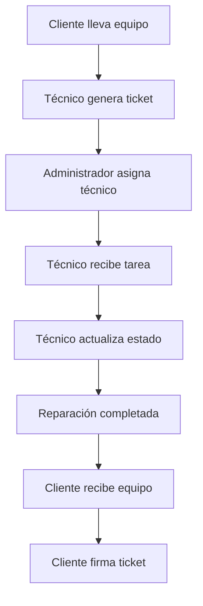
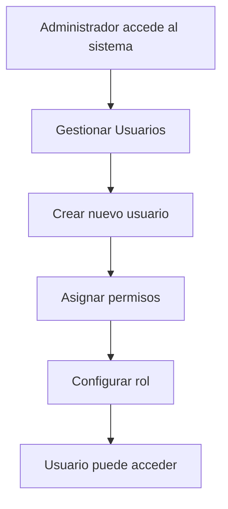
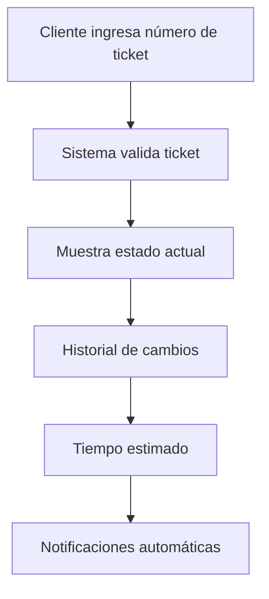

# 📊 Guía Completa de Explicación - Diagramas de Casos de Uso Sistema HDC

## 🎯 **Introducción**

Esta guía explica detalladamente cada diagrama de casos de uso del Sistema HDC (Gestión de Servicios Electrónicos), organizado por módulos y actores. Te ayudará a entender la estructura, relaciones y flujos de trabajo del sistema.

---

## 📋 **Índice de Contenidos**

1. [Estructura General del Sistema](#estructura-general)
2. [Actores y Sus Roles](#actores-y-sus-roles)
3. [Módulos del Sistema](#módulos-del-sistema)
4. [Diagramas por Módulo](#diagramas-por-módulo)
5. [Flujos de Trabajo Principales](#flujos-de-trabajo-principales)
6. [Relaciones entre Casos de Uso](#relaciones-entre-casos-de-uso)
7. [Guía de Implementación](#guía-de-implementación)

---

## 🏗️ **Estructura General del Sistema** {#estructura-general}

### **Resumen del Sistema HDC**
- **Propósito**: Gestión integral de servicios de reparación electrónica
- **Usuarios**: 5 tipos de actores con diferentes niveles de acceso
- **Módulos**: 8 módulos principales + autenticación
- **Casos de Uso**: 30 casos de uso documentados
- **Tecnología**: Sistema web con base de datos

### **Arquitectura de Seguridad**
```
Nivel 1: Administrador (Control Total)
Nivel 2: Técnico (Operativo)
Nivel 3: Usuario (Limitado)
Nivel 4: Cliente (Público)
Nivel 5: Sistema (Automático)
```

---

## 👥 **Actores y Sus Roles** {#actores-y-sus-roles}

### **1. 👨‍💼 ADMINISTRADOR**
**Descripción**: Usuario con control total del sistema
**Responsabilidades**:
- Gestión completa de usuarios y permisos
- Configuración del sistema
- Supervisión de operaciones
- Generación de reportes ejecutivos

**Casos de Uso Principales**:
- Gestionar Usuarios (UC-ADMIN-01)
- Gestionar Técnicos (UC-ADMIN-02)
- Gestionar Clientes (UC-ADMIN-03)
- Gestionar Equipos (UC-ADMIN-04)
- Gestionar Reparaciones (UC-ADMIN-05)
- Gestionar Inventario (UC-ADMIN-06)
- Gestionar Tickets (UC-ADMIN-07)
- Ver Dashboard Completo (UC-ADMIN-08)
- Generar Reportes (UC-ADMIN-09)
- Configurar Sistema (UC-ADMIN-10)
- Gestionar Permisos (UC-ADMIN-11)

### **2. 🔧 TÉCNICO**
**Descripción**: Usuario especializado en reparaciones
**Responsabilidades**:
- Manejo de reparaciones asignadas
- Gestión de equipos
- Generación de tickets
- Actualización de estados

**Casos de Uso Principales**:
- Ver Tareas Asignadas (UC-TEC-01)
- Gestionar Reparaciones Asignadas (UC-TEC-02)
- Actualizar Estado Reparaciones (UC-TEC-03)
- Gestionar Equipos (UC-TEC-04)
- Ver Dashboard Personalizado (UC-TEC-05)
- Generar Tickets (UC-TEC-06)
- Gestionar Inventario Limitado (UC-TEC-07)

### **3. 👤 USUARIO**
**Descripción**: Usuario con acceso limitado
**Responsabilidades**:
- Consulta de información
- Gestión básica de clientes
- Visualización de datos

**Casos de Uso Principales**:
- Ver Dashboard Básico (UC-USER-01)
- Gestionar Clientes Limitado (UC-USER-02)
- Ver Reparaciones Solo Lectura (UC-USER-03)
- Ver Equipos Solo Lectura (UC-USER-04)

### **4. 👥 CLIENTE**
**Descripción**: Usuario externo del sistema
**Responsabilidades**:
- Consulta de estado de reparaciones
- Recepción de servicios
- Interacción con el sistema

**Casos de Uso Principales**:
- Consultar Estado Reparación (UC-CLIENT-01)
- Recibir Notificaciones (UC-CLIENT-02)
- Firmar Tickets (UC-CLIENT-03)
- Recibir Equipos Reparados (UC-CLIENT-04)

### **5. 🤖 SISTEMA**
**Descripción**: Procesos automáticos
**Responsabilidades**:
- Notificaciones automáticas
- Generación de estadísticas
- Backup de datos
- Validación de integridad

**Casos de Uso Principales**:
- Enviar Notificaciones (UC-SYS-01)
- Generar Estadísticas (UC-SYS-02)
- Backup Automático (UC-SYS-03)
- Validar Datos (UC-SYS-04)

---

## 📊 **Módulos del Sistema** {#módulos-del-sistema}

### **Módulo 1: Dashboard**
**Propósito**: Panel principal con estadísticas y resúmenes
**Acceso**: Todos los usuarios (con diferentes niveles)
**Funcionalidades**:
- Estadísticas generales
- Gráficos de rendimiento
- Alertas del sistema
- Widgets personalizables

### **Módulo 2: Gestión de Usuarios**
**Propósito**: Administración de usuarios del sistema
**Acceso**: Solo Administrador
**Funcionalidades**:
- CRUD de usuarios
- Asignación de permisos
- Gestión de roles
- Activación/desactivación

### **Módulo 3: Gestión de Técnicos**
**Propósito**: Administración de técnicos especializados
**Acceso**: Administrador, Técnico (limitado)
**Funcionalidades**:
- CRUD de técnicos
- Asignación de especialidades
- Gestión de carga de trabajo
- Evaluación de rendimiento

### **Módulo 4: Gestión de Clientes**
**Propósito**: Administración de clientes del negocio
**Acceso**: Administrador, Técnico, Usuario (limitado)
**Funcionalidades**:
- CRUD de clientes
- Historial de servicios
- Gestión de contactos
- Segmentación de clientes

### **Módulo 5: Gestión de Equipos**
**Propósito**: Administración de equipos a reparar
**Acceso**: Administrador, Técnico, Usuario (solo lectura)
**Funcionalidades**:
- CRUD de equipos
- Asignación a clientes
- Gestión de estados
- Historial de reparaciones

### **Módulo 6: Gestión de Reparaciones**
**Propósito**: Proceso completo de reparaciones
**Acceso**: Administrador, Técnico
**Funcionalidades**:
- Órdenes de reparación
- Asignación de técnicos
- Seguimiento de estados
- Gestión de garantías

### **Módulo 7: Gestión de Inventario**
**Propósito**: Control de stock y productos
**Acceso**: Administrador, Técnico (limitado)
**Funcionalidades**:
- CRUD de productos
- Control de stock
- Gestión de categorías
- Alertas de stock bajo

### **Módulo 8: Gestión de Tickets**
**Propósito**: Generación y gestión de tickets
**Acceso**: Administrador, Técnico, Cliente
**Funcionalidades**:
- Generación de tickets
- Impresión
- Seguimiento de estados
- Firma digital

---

## 🎨 **Diagramas por Módulo** {#diagramas-por-módulo}

### **Diagrama 1: Sistema Completo (diagrama_plantuml_hdc.puml)**

**Propósito**: Vista general de todo el sistema
**Características**:
- Muestra todos los actores
- Incluye todos los casos de uso
- Relaciones de dependencia e inclusión
- Notas explicativas

**Cómo Interpretarlo**:
1. **Actores** (izquierda): Representan los tipos de usuarios
2. **Casos de Uso** (centro): Funcionalidades del sistema
3. **Relaciones** (flechas):
   - `-->` : Asociación (actor puede ejecutar caso de uso)
   - `..> : <<include>>` : Inclusión (caso de uso incluye otro)
   - `..> : <<extend>>` : Extensión (caso de uso extiende otro)

**Ejemplo de Interpretación**:
```
Admin --> UC1 (Gestionar Usuarios)
UC1 ..> UC_AUTH1 : <<extend>> (Iniciar Sesión)
```
*El Administrador puede gestionar usuarios, pero primero debe iniciar sesión*

### **Diagrama 2: Administrador (diagrama_plantuml_administrador.puml)**

**Propósito**: Enfoque específico en funcionalidades del administrador
**Características**:
- Solo muestra casos de uso del administrador
- Agrupación lógica por funcionalidad
- Dependencias entre casos de uso
- Notas específicas del rol

**Cómo Interpretarlo**:
1. **Gestión de Usuarios y Permisos**: UC1, UC2, UC3
2. **Gestión de Datos Maestros**: UC4, UC5, UC6
3. **Gestión Operativa**: UC7, UC8
4. **Dashboard y Reportes**: UC9, UC10
5. **Configuración del Sistema**: UC11, UC12

### **Diagrama 3: Sistema Simple (diagrama_plantuml_simple.puml)**

**Propósito**: Vista simplificada para presentaciones
**Características**:
- Casos de uso principales solamente
- Sin relaciones complejas
- Enfoque en funcionalidades core
- Fácil de entender

---

## 🔄 **Flujos de Trabajo Principales** {#flujos-de-trabajo-principales}

### **Flujo 1: Proceso de Reparación Completo**



**Casos de Uso Involucrados**:
- UC-TEC-06: Generar Tickets
- UC-ADMIN-05: Gestionar Reparaciones
- UC-TEC-01: Ver Tareas Asignadas
- UC-TEC-03: Actualizar Estado Reparaciones
- UC-CLIENT-03: Firmar Tickets
- UC-CLIENT-04: Recibir Equipos Reparados

### **Flujo 2: Gestión de Usuarios**



**Casos de Uso Involucrados**:
- UC-AUTH-01: Iniciar Sesión
- UC-ADMIN-01: Gestionar Usuarios
- UC-ADMIN-11: Gestionar Permisos

### **Flujo 3: Consulta de Estado por Cliente**



**Casos de Uso Involucrados**:
- UC-CLIENT-01: Consultar Estado Reparación
- UC-SYS-01: Enviar Notificaciones

---

## 🔗 **Relaciones entre Casos de Uso** {#relaciones-entre-casos-de-uso}

### **Tipos de Relaciones**

#### **1. Asociación (-->)**
**Significado**: Un actor puede ejecutar un caso de uso
**Ejemplo**: `Admin --> UC1` (El administrador puede gestionar usuarios)

#### **2. Inclusión (..> : <<include>>)**
**Significado**: Un caso de uso siempre incluye otro
**Ejemplo**: `UC5 ..> UC13 : <<include>>` (Gestionar reparaciones siempre incluye gestionar reparaciones asignadas)

#### **3. Extensión (..> : <<extend>>)**
**Significado**: Un caso de uso puede extender otro bajo ciertas condiciones
**Ejemplo**: `UC1 ..> UC_AUTH1 : <<extend>>` (Gestionar usuarios puede requerir iniciar sesión)

### **Relaciones Críticas del Sistema**

#### **Autenticación (Extensión)**
Todos los casos de uso principales extienden la autenticación:
```
UC1 ..> UC_AUTH1 : <<extend>>
UC2 ..> UC_AUTH1 : <<extend>>
UC3 ..> UC_AUTH1 : <<extend>>
...
```

#### **Dependencias de Negocio (Inclusión)**
```
UC5 ..> UC13 : <<include>> (Reparaciones → Reparaciones Asignadas)
UC4 ..> UC5 : <<include>> (Equipos → Reparaciones)
UC3 ..> UC4 : <<include>> (Clientes → Equipos)
```

#### **Jerarquía de Gestión (Inclusión)**
```
UC1 ..> UC2 : <<include>> (Usuarios → Técnicos)
UC2 ..> UC12 : <<include>> (Técnicos → Tareas Asignadas)
```

---

## 🛠️ **Guía de Implementación** {#guía-de-implementación}

### **Fase 1: Fundamentos (Semanas 1-2)**
1. **Autenticación y Autorización**
   - Implementar UC-AUTH-01 a UC-AUTH-04
   - Configurar roles y permisos
   - Crear sistema de sesiones

2. **Gestión de Usuarios**
   - Implementar UC-ADMIN-01
   - Implementar UC-ADMIN-11
   - Configurar niveles de acceso

### **Fase 2: Módulos Core (Semanas 3-6)**
1. **Gestión de Clientes**
   - Implementar UC-ADMIN-03
   - Implementar UC-USER-02
   - Configurar CRUD básico

2. **Gestión de Equipos**
   - Implementar UC-ADMIN-04
   - Implementar UC-TEC-04
   - Configurar asignación a clientes

3. **Gestión de Reparaciones**
   - Implementar UC-ADMIN-05
   - Implementar UC-TEC-02
   - Configurar flujo de estados

### **Fase 3: Funcionalidades Avanzadas (Semanas 7-10)**
1. **Dashboard y Reportes**
   - Implementar UC-ADMIN-08
   - Implementar UC-TEC-05
   - Implementar UC-ADMIN-09

2. **Sistema de Tickets**
   - Implementar UC-ADMIN-07
   - Implementar UC-TEC-06
   - Implementar UC-CLIENT-01

3. **Notificaciones Automáticas**
   - Implementar UC-SYS-01
   - Configurar envío de alertas
   - Implementar UC-CLIENT-02

### **Fase 4: Optimización (Semanas 11-12)**
1. **Sistema de Backup**
   - Implementar UC-SYS-03
   - Configurar respaldos automáticos

2. **Validación de Datos**
   - Implementar UC-SYS-04
   - Configurar integridad referencial

3. **Configuración del Sistema**
   - Implementar UC-ADMIN-10
   - Personalizar interfaz

---

## 📊 **Matriz de Implementación por Prioridad**

| Prioridad | Casos de Uso | Justificación |
|-----------|--------------|---------------|
| **Alta** | UC-AUTH-01, UC-ADMIN-01, UC-ADMIN-05, UC-TEC-02, UC-CLIENT-01 | Funcionalidades críticas del negocio |
| **Media** | UC-ADMIN-03, UC-ADMIN-04, UC-TEC-06, UC-ADMIN-08, UC-SYS-01 | Funcionalidades importantes para operación |
| **Baja** | UC-ADMIN-10, UC-SYS-03, UC-SYS-04, UC-ADMIN-09 | Funcionalidades de soporte y mantenimiento |

---

## 🎯 **Consejos para Interpretar los Diagramas**

### **1. Comienza por los Actores**
- Identifica qué tipo de usuario eres
- Revisa qué casos de uso puedes ejecutar
- Entiende tus limitaciones y permisos

### **2. Sigue las Flechas**
- **Flechas sólidas (-->)** : Indican qué puede hacer cada actor
- **Flechas punteadas (..>)** : Indican dependencias entre casos de uso

### **3. Lee las Notas**
- Las notas explican el contexto
- Proporcionan información adicional
- Aclaran casos especiales

### **4. Entiende las Agrupaciones**
- Los rectángulos agrupan casos de uso relacionados
- Las agrupaciones indican módulos del sistema
- Facilita la comprensión de la estructura

---

## 🔍 **Casos de Uso Críticos para Entender**

### **UC-ADMIN-05: Gestionar Reparaciones**
**Por qué es crítico**: Es el caso de uso central del sistema
**Flujo principal**:
1. Crear orden de reparación
2. Asignar técnico responsable
3. Gestionar estados de reparación
4. Generar reportes de reparación

### **UC-TEC-02: Gestionar Reparaciones Asignadas**
**Por qué es crítico**: Es donde los técnicos trabajan diariamente
**Flujo principal**:
1. Ver reparaciones asignadas
2. Actualizar progreso
3. Agregar observaciones
4. Cambiar estado

### **UC-CLIENT-01: Consultar Estado Reparación**
**Por qué es crítico**: Es la principal interacción del cliente con el sistema
**Flujo principal**:
1. Ingresar número de ticket
2. Ver estado actual
3. Ver historial de cambios
4. Ver tiempo estimado

---

## 📚 **Recursos Adicionales**

### **Archivos de Diagramas**
- `diagrama_plantuml_hdc.puml` - Sistema completo
- `diagrama_plantuml_administrador.puml` - Enfoque en administrador
- `diagrama_plantuml_simple.puml` - Vista simplificada

### **Documentación**
- `CASOS_DE_USO_DETALLADOS_HDC.md` - Especificaciones completas
- `RESUMEN_CASOS_USO_HDC.md` - Resumen ejecutivo
- `diagrama_casos_uso_hdc.md` - Documentación con Mermaid

### **Herramientas Recomendadas**
- **PlantUML**: Para generar diagramas desde código
- **Mermaid**: Para diagramas en Markdown
- **Draw.io**: Para edición visual
- **Lucidchart**: Para colaboración en equipo

---

## 🎉 **Conclusión**

Los diagramas de casos de uso del Sistema HDC proporcionan una visión completa y estructurada de todas las funcionalidades del sistema. Cada diagrama tiene un propósito específico:

1. **Diagrama Completo**: Para entender el sistema en su totalidad
2. **Diagrama de Administrador**: Para enfocarse en funcionalidades administrativas
3. **Diagrama Simple**: Para presentaciones y comunicación

**Recuerda**:
- Los diagramas son herramientas de comunicación
- Deben actualizarse cuando cambie el sistema
- Son útiles para desarrollo, testing y documentación
- Facilitan la comprensión del negocio

**¡Usa esta guía como referencia para entender y explicar tu sistema HDC! 🚀**

---

*Guía generada automáticamente por el Sistema HDC - Versión 1.0*
