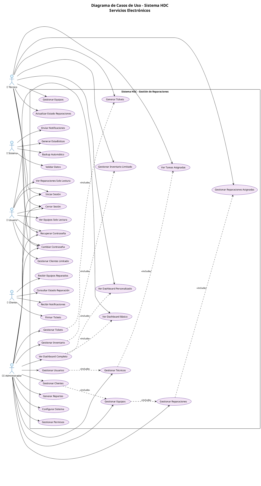
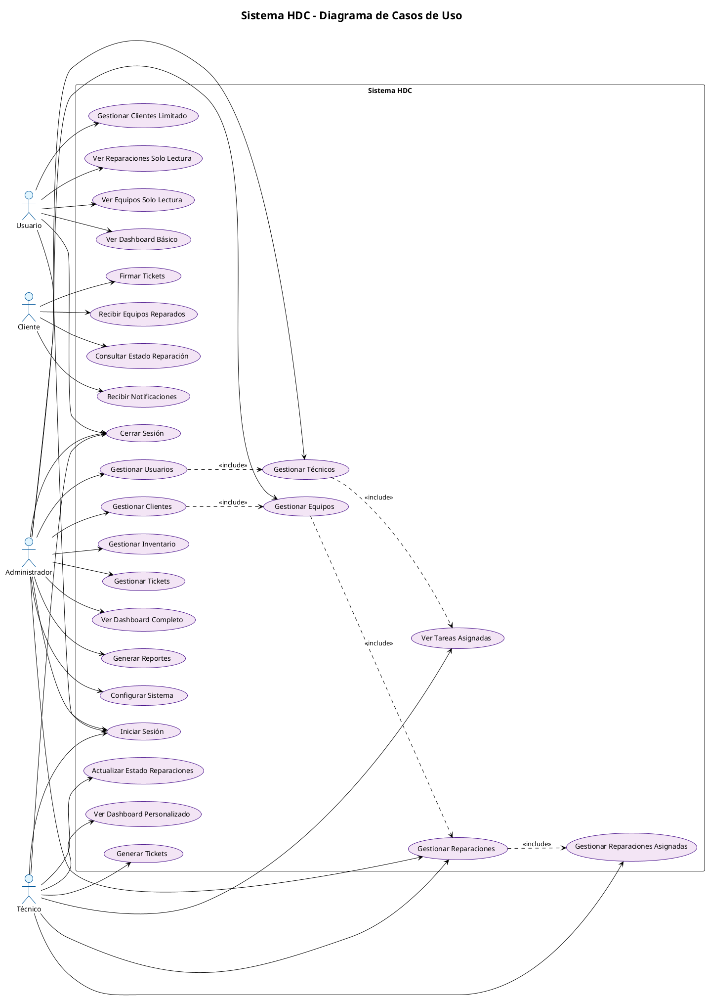

# 🎨 Guía de Uso - PlantUML para Sistema HDC

## 📋 **Archivos PlantUML Creados**

### 1. **`diagrama_plantuml_hdc.puml`** - Diagrama Completo
- **Descripción**: Diagrama completo con todos los actores y casos de uso
- **Actores**: Administrador, Técnico, Usuario, Cliente, Sistema
- **Casos de Uso**: 30 casos de uso identificados
- **Relaciones**: Incluye dependencias e inclusiones
- **Uso**: Para documentación completa del sistema

### 2. **`diagrama_plantuml_simple.puml`** - Versión Simplificada
- **Descripción**: Versión limpia y fácil de leer
- **Actores**: Administrador, Técnico, Usuario, Cliente
- **Casos de Uso**: Casos principales sin detalles excesivos
- **Relaciones**: Dependencias básicas
- **Uso**: Para presentaciones y documentación general

### 3. **`diagrama_plantuml_administrador.puml`** - Solo Administrador
- **Descripción**: Diagrama específico para el rol de Administrador
- **Actores**: Solo Administrador
- **Casos de Uso**: 12 casos de uso del administrador
- **Relaciones**: Dependencias específicas del administrador
- **Uso**: Para documentar funcionalidades administrativas

## 🚀 **Cómo Usar en PlantUML**

### **Paso 1: Acceder a PlantUML**
1. Ve a **https://www.plantuml.com/plantuml/uml/**
2. O usa **PlantUML Online**: https://www.plantuml.com/plantuml/

### **Paso 2: Copiar el Código**
1. Abre el archivo `.puml` que quieras usar
2. Copia **todo el contenido** del archivo
3. Pégalo en el editor de PlantUML

### **Paso 3: Generar el Diagrama**
1. El diagrama se generará automáticamente
2. Si no aparece, haz clic en **"Submit"** o **"Refresh"**
3. Espera a que se procese el código

### **Paso 4: Exportar**
1. Haz clic en **"PNG"** para descargar como imagen
2. Haz clic en **"SVG"** para descargar como vector
3. Usa **"ASCII Art"** para texto plano

## 🎯 **Código Listo para Copiar**

### **Para Diagrama Completo:**


### **Para Diagrama Simplificado:**


## 🎨 **Personalización de Colores**

### **Colores del Sistema HDC:**
```plantuml
skinparam actor {
    BackgroundColor #E1F5FE  ' Azul claro
    BorderColor #01579B      ' Azul oscuro
    FontColor #000000        ' Negro
}
skinparam usecase {
    BackgroundColor #F3E5F5  ' Morado claro
    BorderColor #4A148C      ' Morado oscuro
    FontColor #000000        ' Negro
}
```

### **Colores por Rol:**
```plantuml
' Administrador - Rojo
skinparam actor {
    BackgroundColor #FFEBEE
    BorderColor #B71C1C
}

' Técnico - Verde
skinparam actor {
    BackgroundColor #E8F5E8
    BorderColor #1B5E20
}

' Usuario - Naranja
skinparam actor {
    BackgroundColor #FFF3E0
    BorderColor #E65100
}

' Cliente - Verde claro
skinparam actor {
    BackgroundColor #F1F8E9
    BorderColor #33691E
}
```

## 📊 **Tipos de Relaciones en PlantUML**

### **1. Asociación Simple:**
```plantuml
Actor --> UseCase
```

### **2. Inclusión (Include):**
```plantuml
UseCase1 ..> UseCase2 : <<include>>
```

### **3. Extensión (Extend):**
```plantuml
UseCase1 ..> UseCase2 : <<extend>>
```

### **4. Generalización:**
```plantuml
UseCase1 --|> UseCase2
```

## 🛠️ **Herramientas Alternativas**

### **1. PlantUML Online (Recomendado)**
- URL: https://www.plantuml.com/plantuml/
- No requiere instalación
- Exporta a múltiples formatos

### **2. PlantUML Local**
- Instalar Java
- Descargar PlantUML JAR
- Usar desde línea de comandos

### **3. VS Code con PlantUML**
- Instalar extensión "PlantUML"
- Vista previa en tiempo real
- Exportación integrada

### **4. IntelliJ IDEA**
- Plugin PlantUML integrado
- Generación automática
- Integración con documentación

## 🎯 **Consejos de Uso**

### **✅ Mejores Prácticas:**
1. **Usa nombres descriptivos** para actores y casos de uso
2. **Agrupa casos de uso** relacionados en el mismo rectángulo
3. **Usa relaciones apropiadas** (include, extend, asociación)
4. **Mantén el diagrama legible** - no sobrecargues con detalles
5. **Usa colores consistentes** para diferentes tipos de elementos

### **❌ Evita:**
1. **Demasiados casos de uso** en un solo diagrama
2. **Relaciones cruzadas** excesivas
3. **Nombres muy largos** que dificulten la lectura
4. **Colores muy contrastantes** que cansen la vista
5. **Diagramas muy complejos** sin documentación adicional

## 📈 **Métricas del Sistema HDC**

- **Total de Actores**: 5
- **Total de Casos de Uso**: 30
- **Casos de Uso por Actor**:
  - Administrador: 11
  - Técnico: 7
  - Usuario: 4
  - Cliente: 4
  - Sistema: 4
- **Relaciones Identificadas**: 9
- **Complejidad**: Media-Alta

## 🚀 **Próximos Pasos**

1. **Copia el código** que prefieras usar
2. **Pégalo en PlantUML Online**
3. **Genera el diagrama**
4. **Exporta en el formato** que necesites
5. **Personaliza los colores** según tu marca
6. **Agrega más detalles** si es necesario

**¡Tu diagrama de casos de uso está listo para usar en PlantUML! 🎉**
