# 📊 Diagrama de Casos de Uso - Sistema HDC

## 🎯 **Actores del Sistema**

### **Actores Principales:**
- **Administrador** - Control total del sistema
- **Técnico** - Maneja reparaciones y equipos  
- **Usuario** - Acceso limitado a funcionalidades
- **Cliente** - Interactúa con el sistema (externo)

### **Actores Secundarios:**
- **Sistema de Notificaciones** - Envía alertas automáticas
- **Sistema de Reportes** - Genera estadísticas

## 📋 **Casos de Uso por Actor**

### **👨‍💼 ADMINISTRADOR**
- Gestionar usuarios del sistema
- Gestionar técnicos
- Gestionar clientes
- Gestionar equipos
- Gestionar reparaciones
- Gestionar inventario
- Gestionar tickets
- Ver dashboard completo
- Generar reportes
- Configurar sistema
- Gestionar permisos

### **🔧 TÉCNICO**
- Ver sus tareas asignadas
- Gestionar reparaciones asignadas
- Actualizar estado de reparaciones
- Gestionar equipos
- Ver dashboard personalizado
- Generar tickets
- Gestionar inventario (limitado)

### **👤 USUARIO**
- Ver dashboard básico
- Gestionar clientes (limitado)
- Ver reparaciones (solo lectura)
- Ver equipos (solo lectura)

### **👥 CLIENTE (Externo)**
- Consultar estado de reparación
- Recibir notificaciones
- Firmar tickets
- Recibir equipos reparados

## 🎨 **Diagrama de Casos de Uso (Código Mermaid)**

```mermaid
graph TB
    %% Actores
    Admin[👨‍💼 Administrador]
    Tecnico[🔧 Técnico]
    Usuario[👤 Usuario]
    Cliente[👥 Cliente]
    Sistema[🤖 Sistema]

    %% Casos de Uso - Administrador
    Admin --> UC1[Gestionar Usuarios]
    Admin --> UC2[Gestionar Técnicos]
    Admin --> UC3[Gestionar Clientes]
    Admin --> UC4[Gestionar Equipos]
    Admin --> UC5[Gestionar Reparaciones]
    Admin --> UC6[Gestionar Inventario]
    Admin --> UC7[Gestionar Tickets]
    Admin --> UC8[Ver Dashboard Completo]
    Admin --> UC9[Generar Reportes]
    Admin --> UC10[Configurar Sistema]
    Admin --> UC11[Gestionar Permisos]

    %% Casos de Uso - Técnico
    Tecnico --> UC12[Ver Tareas Asignadas]
    Tecnico --> UC13[Gestionar Reparaciones Asignadas]
    Tecnico --> UC14[Actualizar Estado Reparaciones]
    Tecnico --> UC15[Gestionar Equipos]
    Tecnico --> UC16[Ver Dashboard Personalizado]
    Tecnico --> UC17[Generar Tickets]
    Tecnico --> UC18[Gestionar Inventario Limitado]

    %% Casos de Uso - Usuario
    Usuario --> UC19[Ver Dashboard Básico]
    Usuario --> UC20[Gestionar Clientes Limitado]
    Usuario --> UC21[Ver Reparaciones Solo Lectura]
    Usuario --> UC22[Ver Equipos Solo Lectura]

    %% Casos de Uso - Cliente
    Cliente --> UC23[Consultar Estado Reparación]
    Cliente --> UC24[Recibir Notificaciones]
    Cliente --> UC25[Firmar Tickets]
    Cliente --> UC26[Recibir Equipos Reparados]

    %% Casos de Uso - Sistema
    Sistema --> UC27[Enviar Notificaciones]
    Sistema --> UC28[Generar Estadísticas]
    Sistema --> UC29[Backup Automático]
    Sistema --> UC30[Validar Datos]

    %% Relaciones entre casos de uso
    UC5 --> UC13
    UC4 --> UC5
    UC3 --> UC4
    UC2 --> UC12
    UC1 --> UC2
    UC6 --> UC18
    UC7 --> UC17
    UC8 --> UC16
    UC8 --> UC19

    %% Estilos
    classDef actor fill:#e1f5fe,stroke:#01579b,stroke-width:2px
    classDef usecase fill:#f3e5f5,stroke:#4a148c,stroke-width:2px
    classDef admin fill:#ffebee,stroke:#b71c1c,stroke-width:2px
    classDef tecnico fill:#e8f5e8,stroke:#1b5e20,stroke-width:2px
    classDef usuario fill:#fff3e0,stroke:#e65100,stroke-width:2px
    classDef cliente fill:#f1f8e9,stroke:#33691e,stroke-width:2px

    class Admin actor
    class Tecnico actor
    class Usuario actor
    class Cliente actor
    class Sistema actor

    class UC1,UC2,UC3,UC4,UC5,UC6,UC7,UC8,UC9,UC10,UC11 admin
    class UC12,UC13,UC14,UC15,UC16,UC17,UC18 tecnico
    class UC19,UC20,UC21,UC22 usuario
    class UC23,UC24,UC25,UC26 cliente
    class UC27,UC28,UC29,UC30 usecase
```



## 📝 **Descripción Detallada de Casos de Uso**

### **🔐 Casos de Uso de Autenticación**
- **UC-AUTH-01**: Iniciar Sesión
- **UC-AUTH-02**: Cerrar Sesión
- **UC-AUTH-03**: Recuperar Contraseña
- **UC-AUTH-04**: Cambiar Contraseña

### **👨‍💼 Casos de Uso de Administrador**
- **UC-ADMIN-01**: Gestionar Usuarios
  - Crear usuario
  - Editar usuario
  - Eliminar usuario
  - Asignar permisos
- **UC-ADMIN-02**: Gestionar Técnicos
  - Registrar técnico
  - Asignar especialidad
  - Gestionar carga de trabajo
- **UC-ADMIN-03**: Gestionar Clientes
  - Registrar cliente
  - Editar información
  - Ver historial
- **UC-ADMIN-04**: Gestionar Equipos
  - Registrar equipo
  - Asignar a cliente
  - Gestionar estado
- **UC-ADMIN-05**: Gestionar Reparaciones
  - Crear orden de reparación
  - Asignar técnico
  - Gestionar estado
  - Generar reportes
- **UC-ADMIN-06**: Gestionar Inventario
  - Agregar productos
  - Control de stock
  - Gestionar categorías
- **UC-ADMIN-07**: Gestionar Tickets
  - Generar tickets
  - Gestionar estados
  - Imprimir tickets
- **UC-ADMIN-08**: Ver Dashboard Completo
  - Estadísticas generales
  - Gráficos de rendimiento
  - Alertas del sistema
- **UC-ADMIN-09**: Generar Reportes
  - Reportes de reparaciones
  - Reportes de técnicos
  - Reportes financieros
- **UC-ADMIN-10**: Configurar Sistema
  - Configurar colores
  - Gestionar módulos
  - Configurar notificaciones
- **UC-ADMIN-11**: Gestionar Permisos
  - Asignar roles
  - Configurar accesos
  - Gestionar módulos

### **🔧 Casos de Uso de Técnico**
- **UC-TEC-01**: Ver Tareas Asignadas
  - Lista de reparaciones pendientes
  - Prioridades
  - Fechas límite
- **UC-TEC-02**: Gestionar Reparaciones Asignadas
  - Actualizar progreso
  - Agregar observaciones
  - Cambiar estado
- **UC-TEC-03**: Actualizar Estado Reparaciones
  - Marcar como en proceso
  - Marcar como completada
  - Agregar notas técnicas
- **UC-TEC-04**: Gestionar Equipos
  - Ver detalles del equipo
  - Actualizar información
  - Gestionar componentes
- **UC-TEC-05**: Ver Dashboard Personalizado
  - Sus estadísticas
  - Tareas pendientes
  - Progreso mensual
- **UC-TEC-06**: Generar Tickets
  - Ticket de ingreso
  - Ticket de entrega
  - Ticket de servicio
- **UC-TEC-07**: Gestionar Inventario Limitado
  - Ver stock disponible
  - Solicitar productos
  - Actualizar uso

### **👤 Casos de Uso de Usuario**
- **UC-USER-01**: Ver Dashboard Básico
  - Información general
  - Accesos limitados
- **UC-USER-02**: Gestionar Clientes Limitado
  - Ver lista de clientes
  - Agregar cliente básico
- **UC-USER-03**: Ver Reparaciones Solo Lectura
  - Consultar estado
  - Ver historial
- **UC-USER-04**: Ver Equipos Solo Lectura
  - Consultar información
  - Ver historial

### **👥 Casos de Uso de Cliente**
- **UC-CLIENT-01**: Consultar Estado Reparación
  - Por número de ticket
  - Por número de teléfono
- **UC-CLIENT-02**: Recibir Notificaciones
  - SMS de estado
  - Email de actualizaciones
- **UC-CLIENT-03**: Firmar Tickets
  - Ticket de ingreso
  - Ticket de entrega
- **UC-CLIENT-04**: Recibir Equipos Reparados
  - Confirmar entrega
  - Recibir garantía

### **🤖 Casos de Uso del Sistema**
- **UC-SYS-01**: Enviar Notificaciones
  - Automáticas por estado
  - Recordatorios
- **UC-SYS-02**: Generar Estadísticas
  - Cálculos automáticos
  - Métricas de rendimiento
- **UC-SYS-03**: Backup Automático
  - Respaldo diario
  - Recuperación de datos
- **UC-SYS-04**: Validar Datos
  - Integridad de datos
  - Validaciones de negocio

## 🛠️ **Herramientas para Crear el Diagrama**

### **1. Mermaid Live Editor (Recomendado)**
- URL: https://mermaid.live/
- Copia el código Mermaid de arriba
- Genera el diagrama automáticamente
- Exporta como PNG, SVG o PDF

### **2. Visual Studio Code**
- Instala la extensión "Mermaid Preview"
- Crea un archivo .md con el código
- Vista previa en tiempo real

### **3. Draw.io (Ahora diagrams.net)**
- URL: https://app.diagrams.net/
- Herramienta visual drag & drop
- Templates para casos de uso

### **4. Lucidchart**
- Herramienta profesional
- Templates específicos para UML
- Colaboración en tiempo real

## 📊 **Script para Generar Diagrama Automáticamente**

```javascript
// Script para generar diagrama de casos de uso
function generarDiagramaCasosUso() {
    const actores = [
        { nombre: 'Administrador', color: '#ffebee' },
        { nombre: 'Técnico', color: '#e8f5e8' },
        { nombre: 'Usuario', color: '#fff3e0' },
        { nombre: 'Cliente', color: '#f1f8e9' }
    ];
    
    const casosUso = [
        // Administrador
        'Gestionar Usuarios', 'Gestionar Técnicos', 'Gestionar Clientes',
        'Gestionar Equipos', 'Gestionar Reparaciones', 'Gestionar Inventario',
        'Gestionar Tickets', 'Ver Dashboard Completo', 'Generar Reportes',
        'Configurar Sistema', 'Gestionar Permisos',
        
        // Técnico
        'Ver Tareas Asignadas', 'Gestionar Reparaciones Asignadas',
        'Actualizar Estado Reparaciones', 'Gestionar Equipos',
        'Ver Dashboard Personalizado', 'Generar Tickets',
        'Gestionar Inventario Limitado',
        
        // Usuario
        'Ver Dashboard Básico', 'Gestionar Clientes Limitado',
        'Ver Reparaciones Solo Lectura', 'Ver Equipos Solo Lectura',
        
        // Cliente
        'Consultar Estado Reparación', 'Recibir Notificaciones',
        'Firmar Tickets', 'Recibir Equipos Reparados'
    ];
    
    return { actores, casosUso };
}
```

## 🎯 **Próximos Pasos**

1. **Usar Mermaid Live Editor** para generar el diagrama visual
2. **Personalizar colores** según tu preferencia
3. **Agregar más detalles** a los casos de uso
4. **Documentar flujos** específicos de cada caso de uso
5. **Crear diagramas de secuencia** para casos de uso complejos

## 📚 **Recursos Adicionales**

- **UML Use Case Diagrams**: https://www.uml-diagrams.org/use-case-diagrams.html
- **Mermaid Documentation**: https://mermaid-js.github.io/mermaid/
- **UML Best Practices**: https://www.visual-paradigm.com/guide/uml-unified-modeling-language/uml-use-case-diagram-tutorial/

¡Con esta información puedes crear un diagrama de casos de uso completo y profesional para tu sistema HDC! 🎉
